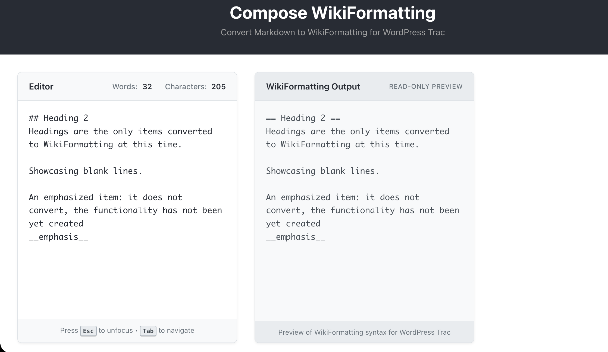

# Compose WikiFormatting



A React-based web application for composing documents in WikiFormatting syntax for WordPress Trac.

## Purpose

WordPress core uses [Trac](https://core.trac.wordpress.org) for issue tracking, which uses [WikiFormatting](https://core.trac.wordpress.org/wiki/WikiFormatting) - a syntax significantly different from Markdown. This tool helps users familiar with Markdown/GitHub easily compose and convert documents to WikiFormatting.

## Features

### Phase 1: Header Conversion ✅
- ✏️ **Live Editor**: Type Markdown with real-time word/character counting
- 🔄 **Header Conversion**: ATX-style headers (# to ######) → WikiFormatting (= to ======)
- 🔒 **Security**: XSS prevention via HTML entity escaping
- 📊 **Two Views**: Side-by-side Editor and WikiFormatting Preview

### Phase 2: WikiFormatting Renderer ✅
- 🎨 **Three-Column Layout**: Editor | WikiFormatting Syntax | Rendered Preview
- 🖼️ **Live Rendering**: See how WikiFormatting appears on WordPress Trac
- ⚡ **Instant Updates**: Real-time conversion pipeline (Markdown → WikiFormatting → Rendered HTML)
- 🎯 **Trac-Accurate Styling**: Matches WordPress Trac theme with proper heading hierarchy
- 📱 **Fully Responsive**: 3 columns on desktop → 2 on tablet → 1 on mobile
- 🔒 **React-Safe Rendering**: Pure React components (no dangerouslySetInnerHTML)
- 🔗 **Section Anchors**: Click-to-link ¶ symbols on headings

### Phase 2.5: LocalStorage Persistence ✅
- 💾 **Auto-Save**: Content automatically saved to localStorage
- 🔄 **Auto-Restore**: Content restored on page load
- ⚡ **Debounced Saves**: 500ms delay prevents excessive writes
- 🔧 **WordPress-Ready**: Storage format maps to block attributes for easy plugin conversion
- 🧹 **Clear Storage**: Confirmation prompt before clearing saved data

### Documentation Sidebar ✅
- 📚 **Collapsible Reference**: Quick access to WikiFormatting documentation
- 📖 **5 Categories**: Basics, Lists & Structure, Text Formatting, Links & References, Advanced Features
- 🔗 **20+ Direct Links**: Specific anchors to https://trac.ffmpeg.org/wiki/WikiFormatting sections
- ↔️ **Toggle Open/Closed**: 320px ↔ 50px smooth animations
- 📱 **Fully Responsive**: Desktop, tablet, and mobile support
- ♿ **Accessibility**: ARIA labels, keyboard navigation
- 🔗 **External Indicators**: Visual feedback on hover
- 🧪 **13 Tests**: 100% coverage

### Phase 3: Text Formatting ✅
- **Bold**: `**text**` or `__text__` → `'''text'''`
- **Italic**: `*text*` or `_text_` → `''text''`
- **Bold+Italic**: `***text***` → `'''''text'''''`
- 🔄 **Full Pipeline**: Formatting converts in headers and body text
- 🎯 **Smart Boundaries**: Proper detection (no spaces after/before markers)
- 🧪 **40 Tests**: 100% coverage on text formatting conversion

### Phase 4a: Links Conversion ✅
- **External Links**: `[text](url)` → `[url text]` (WikiFormatting syntax)
- **Wiki Links**: `[[WikiPage]]` preserved (same syntax in both formats)
- **Automatic URLs**: `http://example.com` preserved
- 🔗 **Multiple Links**: Handles multiple links per line
- 🌍 **Unicode Support**: Special characters, Unicode, emoji in link text
- 🧪 **42 Tests**: 100% coverage on links conversion

### Phase 4b: Links Rendering ✅
- **Live Link Rendering**: WikiFormatting links → clickable HTML in Column 3
- **External Links**: `[url text]` → clickable links with security validation
- **Wiki Links**: `[[WikiPage]]` → Trac-style `/wiki/` links
- **Trac-Specific**: `[ticket:123]`, `[changeset:456]`, `[source:path]` all supported
- 🔒 **Security**: Dangerous protocols blocked (javascript:, data:, file:, vbscript:)
- 🎨 **Formatted Links**: Bold/italic text inside links renders correctly
- 🐛 **Bug Fix**: URLs with underscores & parentheses now work (Wikipedia, etc.)
- 📋 **Design Decisions**: Protocol-relative URLs allowed, path traversal blocked
- 🧪 **68 Tests**: 42 conversion + 26 rendering, 100% coverage

### Phase 5a: Code Blocks Conversion ✅
- **Fenced Code Blocks**: ` ```lang ` → `{{{#!lang` with language support
- **Generic Code Blocks**: ` ``` ` → `{{{` / `}}}`
- **Language Normalization**: js→javascript, ts→javascript, sh→bash, md→markdown
- **Nested Blocks**: 4+ backticks preserve inner fences as literal text
- 🔒 **Content Protection**: Headers, bold, italic, links NOT converted inside code
- 🛡️ **Extract/Restore Pattern**: Protects code from other converters
- 🧪 **58 Tests**: 49 unit + 9 integration, 100% coverage

### Phase 5b: Code Blocks Rendering ✅
- **Code Block Rendering**: `{{{` → `<pre><code>` with GitHub-style styling
- **Language Classes**: `{{{#!javascript` → `<code className="language-javascript">`
- **Inline Code**: `` `code` `` → `<code>` in paragraphs and headers
- **Nested Delimiters**: Inner `{{{` preserved as literal text
- 🔒 **XSS Prevention**: 47 security test cases, all malicious code escaped
- 🎨 **Dark Mode**: Full dark theme support for code blocks
- ⚛️ **Pure React**: No dangerouslySetInnerHTML, React auto-escaping only
- 🧪 **74 Tests**: 47 unit + 27 integration, 100% coverage

### Phase 6: Blockquotes (Complete) ✅
**Phase 6a & 6b: Discussion Citations** - Email-style `>` markers
- **Blockquote Conversion**: Markdown `>` preserved (same syntax as WikiFormatting)
- **Nested Blockquotes**: `>>`, `>>>`, `>>>>` with progressive colored borders
- **Formatting Inside Quotes**: Bold, italic, links, inline code all work
- **Code Blocks in Quotes**: Trac-compatible fenced code blocks inside blockquotes
- 🎨 **Color-Coded Nesting**: Red (L1) → Green (L2) → Blue (L3) → Pink (L4)
- 🔒 **XSS Prevention**: React auto-escaping, all malicious content rendered as text
- ⚛️ **Nested React Structure**: Proper DOM nesting for accurate Trac rendering

**Phase 6c: Standard Blockquotes** - 2-space indent syntax
- **Standard Blockquotes**: 2+ space indented lines render as `<blockquote>` (no citation class)
- **Visual Distinction**: Gray background vs. colored borders for Discussion Citations
- **Indented Code Blocks**: Fenced code blocks with leading whitespace now supported
- **Inline Code Protection**: Backticks protected from text formatting conversion
- 🎨 **Dark Mode**: Full dark theme support for both blockquote types
- 🔧 **Enhanced Converter**: Handles indented code blocks, preserves line-by-line indentation

**Combined Stats:**
- 🧪 **158 Total Tests**: 79 conversion + 70 rendering + 9 integration, 100% coverage
- 📝 **Trac Bug Documented**: Discovered potential nesting bug in WordPress Trac renderer
- 🛡️ **Security**: All XSS vectors tested and blocked

### Coming Soon
- 📋 **Copy to Clipboard**: One-click copy of WikiFormatting
- ⌨️ **Keyboard Shortcuts**: Tab, Escape, CMD/CTRL+S
- **Phase 7+**: Lists, tables, images

## Technology Stack

- **React 18.3+**: UI components with functional components & hooks
- **Custom Converters**: Pure JavaScript converters (WordPress-portable)
  - `converters/` - Markdown → WikiFormatting
  - `renderers/` - WikiFormatting → React components
- **Jest & @testing-library/react**: 600+ tests, 100% coverage on converters
- **CSS Grid**: Responsive three-column layout
- **No external parsing libraries**: All conversion logic custom-built

## Getting Started

### Prerequisites

- Node.js 16+ and npm

### Installation

```bash
# Install dependencies
npm install

# Start development server
npm start
```

The app will open at [http://localhost:3000](http://localhost:3000)

### Testing

```bash
# Run tests
npm test

# Run tests with coverage
npm run test:coverage
```

**Current Status:**
- ✅ 600+ tests passing (15+ test suites)
- ✅ 100% coverage on converter and renderer functions
- ✅ 90%+ overall coverage (above 80% requirement)
- ✅ 7 security reviews passed (0 vulnerabilities)

### Building for Production

```bash
npm run build
```

## Development Workflow

This project follows **test-driven development** with strict security requirements:

1. **Incremental Phases**: 10 phases planned, Phase 6 complete (see PLAN.md)
2. **Security First**: Every commit must pass `/security-review`
3. **100% Test Coverage**: All converter functions fully tested
4. **Branch Strategy**: Sequential merge-then-branch (feature → trunk → new feature)
5. **Quality Gates**: 
   - All tests pass (`npm test`)
   - Security review passes
   - 100% JSDoc documentation
   - ESLint clean

## Roadmap

### Current Progress (6/10 phases complete - 9 sub-phases done!)
- ✅ **Phase 1**: Headers conversion (Markdown → WikiFormatting)
- ✅ **Phase 2**: WikiFormatting renderer (three-column layout)
- ✅ **Phase 2.5**: LocalStorage persistence (auto-save/restore)
- ✅ **Phase 3**: Text formatting (bold, italic)
- ✅ **Phase 3.5**: Text formatting renderer (bold, italic display)
- ✅ **Phase 4a**: Links conversion (Markdown → WikiFormatting)
- ✅ **Phase 4b**: Links renderer (with URL validation, security filtering)
- ✅ **Phase 5a**: Code blocks conversion (Markdown → WikiFormatting)
- ✅ **Phase 5b**: Code blocks renderer (with syntax highlighting prep)
- ✅ **Phase 6**: Blockquotes (Discussion Citations + Standard Blockquotes)
- ⏳ **Phase 7**: Tables (pipe tables, headers, cell alignment)
- ⏳ **Phase 8**: Images (Markdown syntax → WikiFormatting)
- ⏳ **Phase 9**: Lists (unordered, ordered, nested - most complex, moved to last)

### Future Versions
- **v1.0.1**: WordPress plugin - Convert Gutenberg blocks
- **v1.1.0**: Multi-format conversion (doc, txt, Markdown files)
- **v1.2.0**: Document upload and conversion
- **v1.3.0**: Trac Preferences integration
- **v2.0.0**: Public website deployment

## Project Structure

```
compose-wikiformatting/
├── src/
│   ├── components/      # React components
│   │   ├── Editor.jsx           # Markdown input with word/char count
│   │   ├── Preview.jsx          # WikiFormatting syntax display
│   │   ├── RenderedView.jsx     # Rendered HTML preview (Trac-style)
│   │   └── Sidebar.jsx          # Documentation links
│   ├── converters/      # Markdown → WikiFormatting
│   │   ├── headers.js           # Header conversion logic
│   │   ├── textFormatting.js    # Bold, italic conversion
│   │   ├── links.js             # Link syntax conversion
│   │   ├── codeBlocks.js        # Code block conversion & protection
│   │   ├── blockquotes.js       # Blockquote conversion
│   │   └── markdownToWiki.js    # Main converter orchestrator
│   ├── renderers/       # WikiFormatting → Display
│   │   ├── wikiToReact.js       # WikiFormatting → React components (main)
│   │   ├── codeBlocks.js        # Code block & inline code rendering
│   │   ├── blockquotes.js       # Discussion Citations & Standard Blockquotes
│   │   └── wikiToHtml.js        # WikiFormatting → HTML (reference)
│   ├── utils/           # Utilities
│   │   ├── storage.js           # LocalStorage with WordPress-ready format
│   │   └── useDebounce.js       # Custom debounce hook
│   ├── App.jsx          # Three-column layout & state management
│   └── index.js         # Entry point
├── public/              # Static assets
├── docs/                # WikiFormatting cheatsheet
├── PLAN.md              # 9-phase implementation plan
└── CHANGELOG.md         # Detailed feature changelog
```

## Contributing

This is a private repository. For questions or suggestions, contact seth@flexperception.com.

## License

MIT
